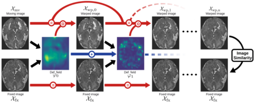

# CasReg

## Introduction

  

CasReg is a deep learning model based on cascaded networks, that produce small amounts of displacement to warp progressively the moving image towards the fixed image. 

The trained registration model can then be used to perform Multi-Atlas Segmentation (MAS) : multiple annotated images and their labels are registered with the image to segment, the resulting warped labels are then combined to form a refined segmentation.

This repository includes:
  - A preprocessing script, that convert Nifti images (and optionally labels) to .npz format. The images are then cropped, resized and normalized.
  - Training and testing script for cascaded registration.
  - A multi-atlas segmentation script using the trained weights of the cascaded registration.
